# Application E-Banking (Backend & Frontend)

Application sécurisée développée avec **Spring Boot** pour le backend et **Angular** pour le frontend, permettant la gestion des opérations bancaires : création de clients, ouverture de comptes (courants et épargne), opérations financières (crédit, débit, virement) et consultation de l’historique des opérations via une interface web.

## Annexes

Cette section regroupe des captures d’écran illustrant le fonctionnement global de l’application **E-Banking**, aussi bien côté **Backend** (API REST, base de données, console H2, Swagger) que côté **Frontend** (interfaces utilisateur, formulaires, affichages et filtrage des données).

---

### Documentation API (Swagger / OpenAPI)

- Interface Swagger UI  
  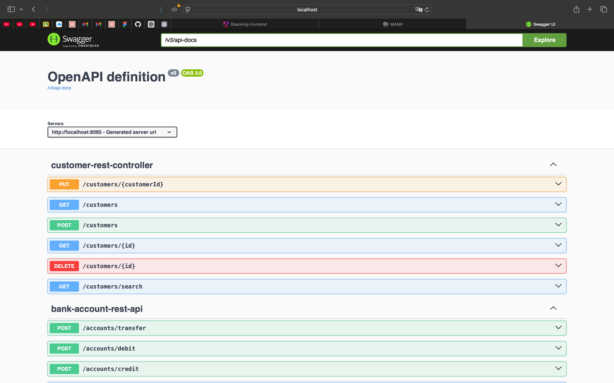

- Spécification OpenAPI (JSON)  
  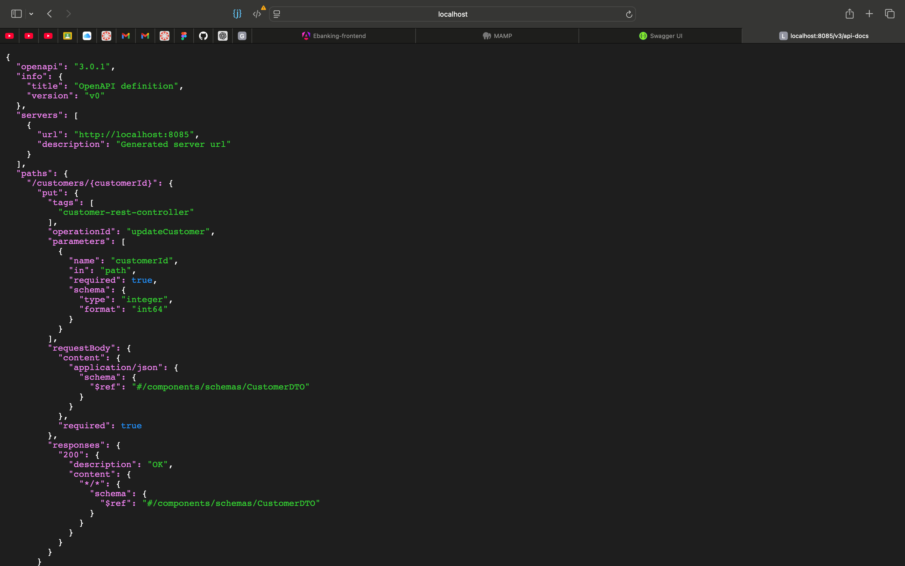

---

### Base de données

- Structure des tables  
  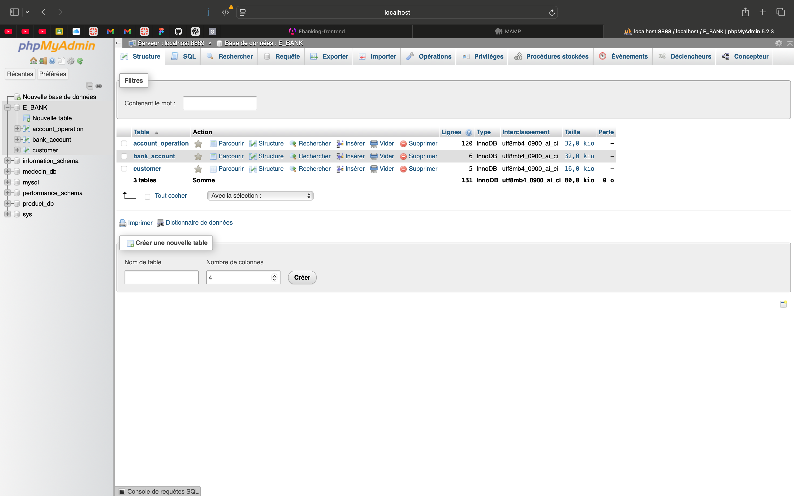

### Gestion des clients

- Ajout d’un client  
  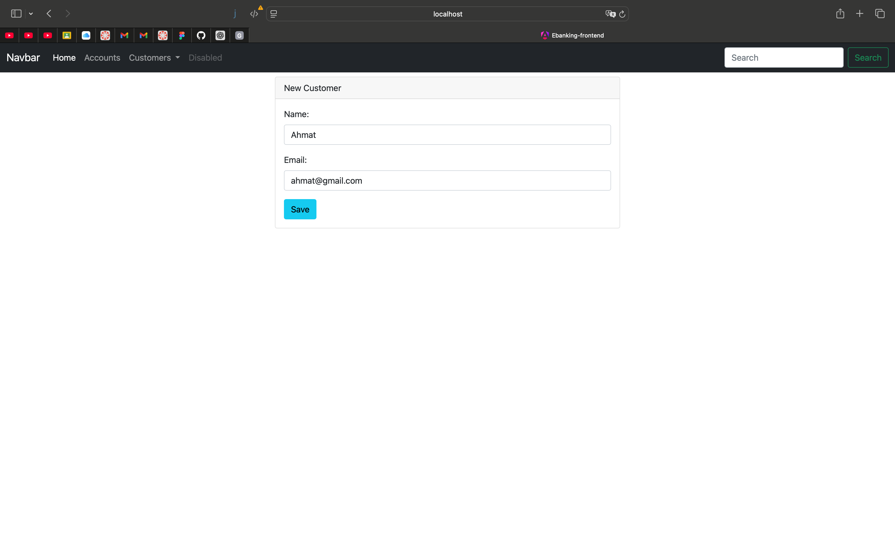

- Liste des clients  
  

- Filtrage des clients
  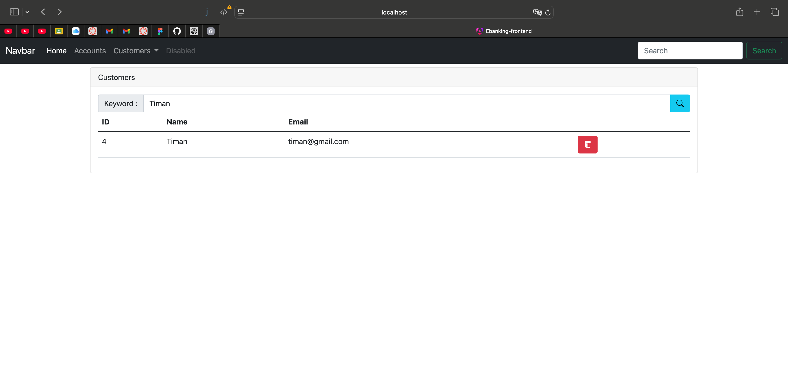

- Console H2 – Clients  
  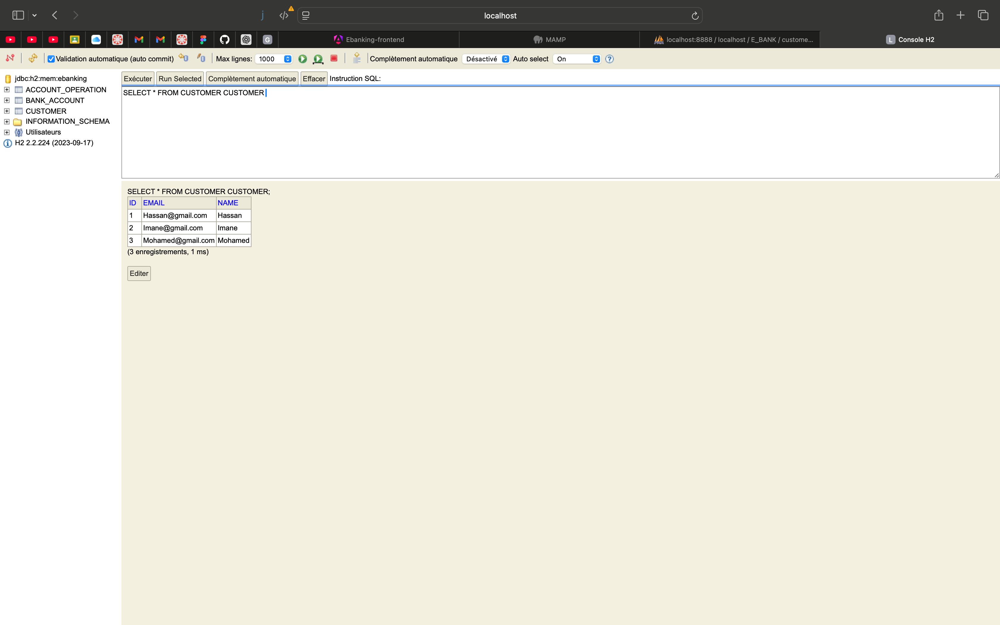

- Base de données MySQL – Clients  
  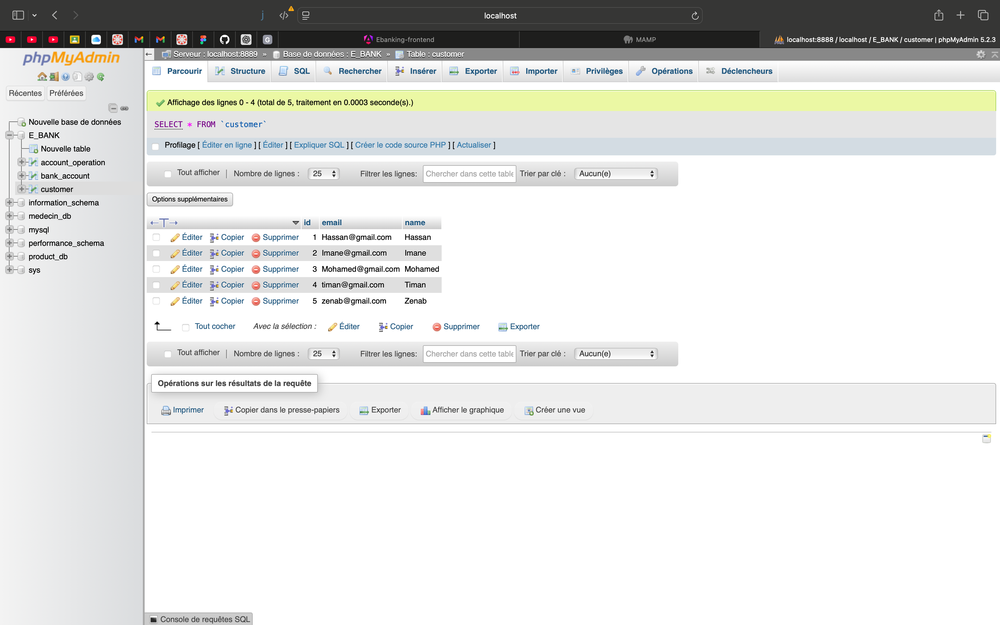

---

### Gestion des comptes bancaires

- Liste des comptes  
  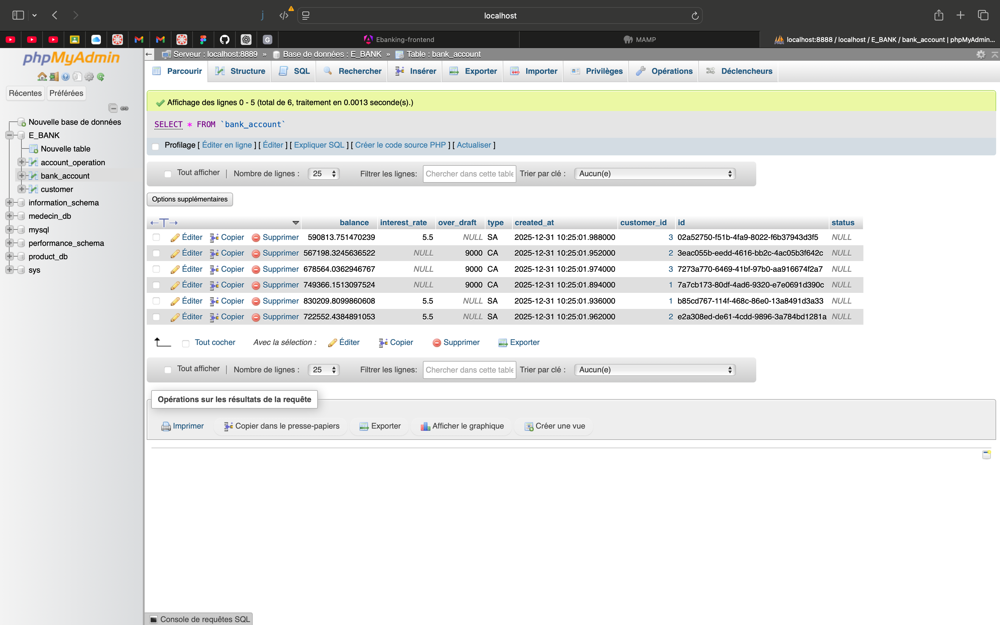

- Console H2 – Comptes  
  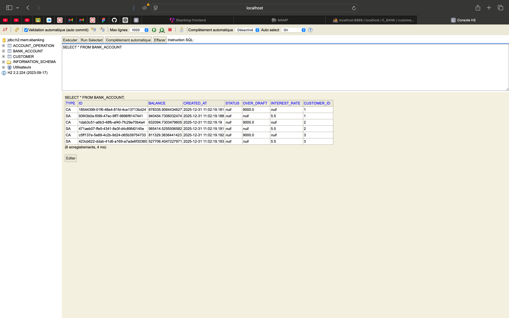

---

### Opérations bancaires

- Opération de crédit  
  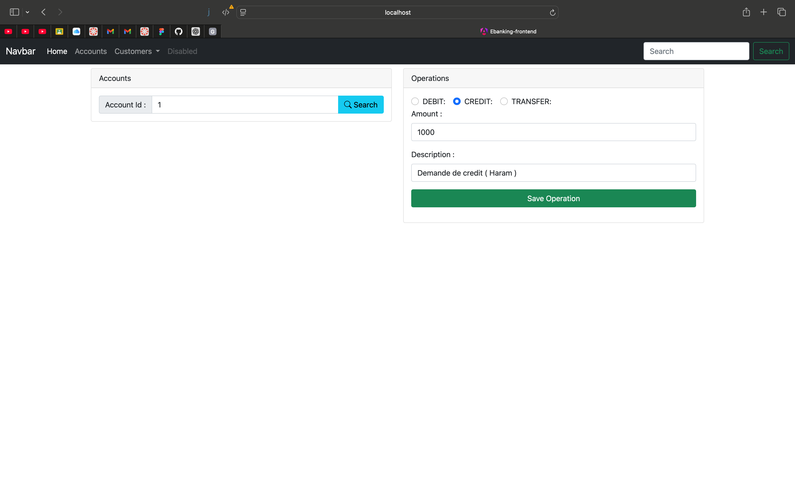

- Opération de débit  
  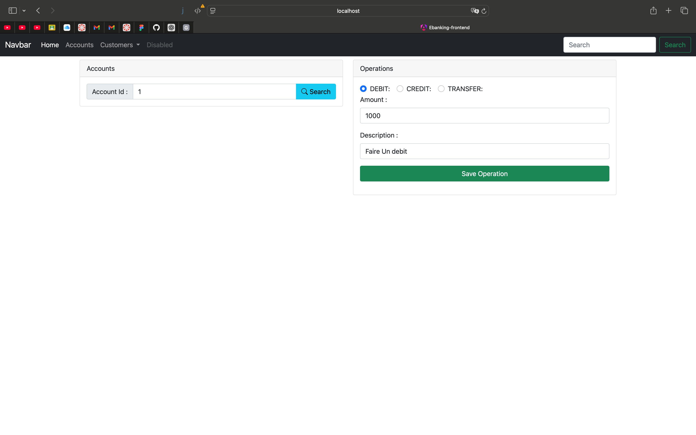
  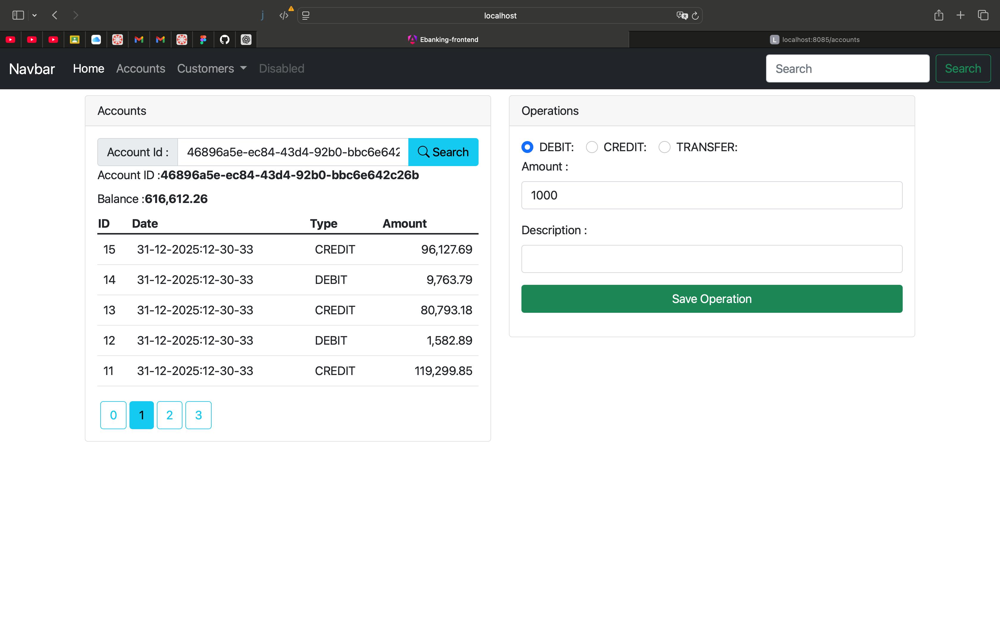

- Virement entre comptes  
  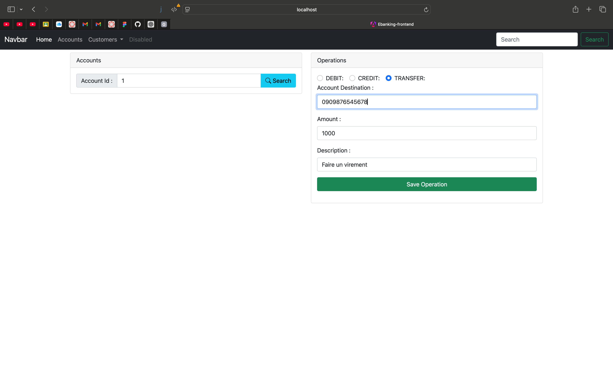

- Historique des opérations  
  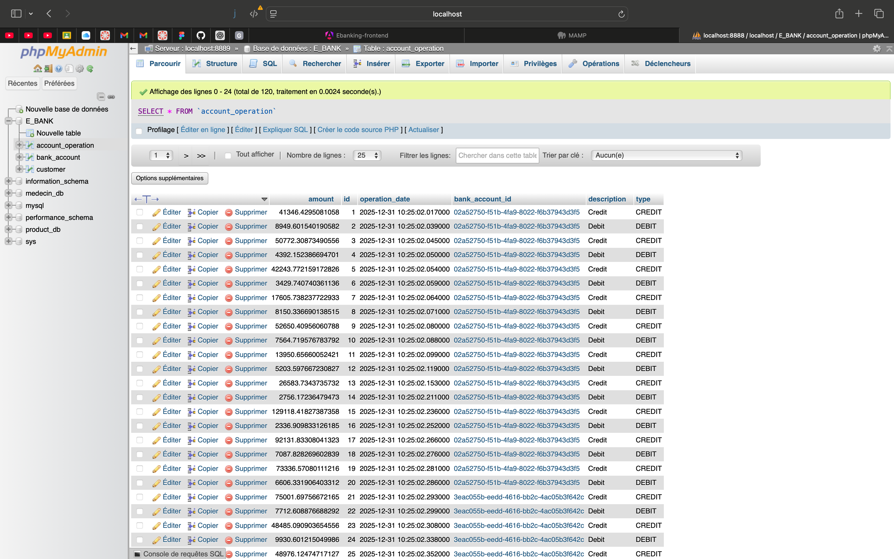

- Console H2 – Opérations  
  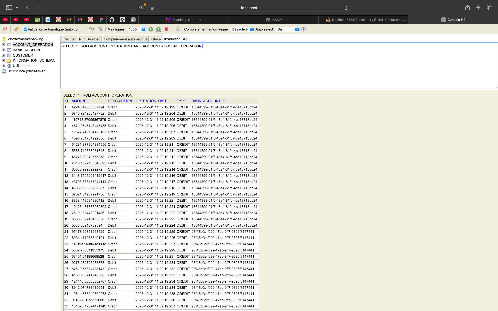

### Sécurité :
- Authentication par defaut :
  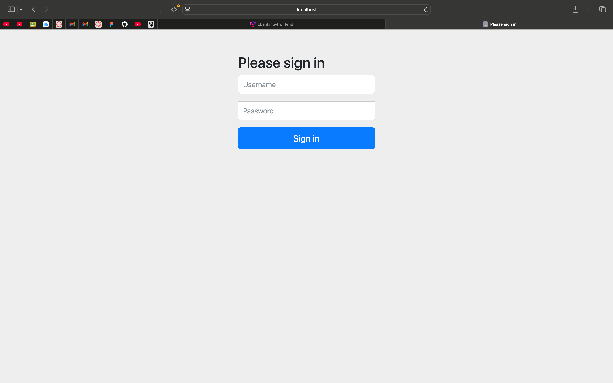